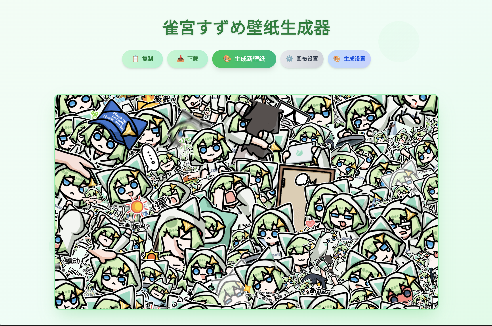

# 遐蝶 壁纸生成器

https://castorice.azusa-mikan.sakuravalley.xyz



### 环境配置

在项目根目录创建 `.env` 文件，配置以下环境变量：

```env
# 网站基础 URL
VITE_BASE_URL=https://your-domain.com
VITE_ICP_NUMBER=京ICP备123456789号
```

### 特别感谢

- https://github.com/kermanx/suzume-wallpaper

### 素材来源

https://t.me/castoricerin

原作者：[小熊貓](https://space.bilibili.com/391634082)

素材内容为 AI 创作，请仔细甄别
